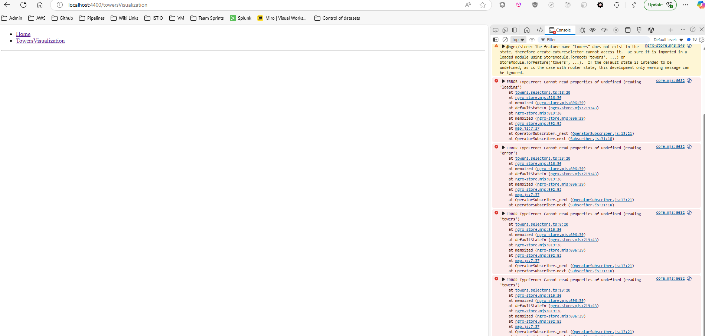

# TowersVisualization

 The mfe approach is not working as I can't share the store between the mfe and shell app. The shell has an error 
  

## Assumptions

I am assuming that the service is continuously emmiting new values and will then update the UI.
I am also assuming that if there is no growth tray in a slot there was none in that slot.
I am assuming that if a growth tray does not have a growth job there was none for that growth tray. It could also be that it finished the previous job.

I also added a retry button in case there is an error such as service unavailable and the user wants to retry fetching data.

## Running the app

To run the app open a terminal in the ```igs/igs-takehome```

- Run the host:
In the terminal build the image with 
```bash
docker build -t shell-app -f Dockerfile.shell .
```

Run the app with
```bash
docker run -p 8080:80 shell-app
```
Then go to: http://localhost:8081/


- Run the micro frontend: 
In the terminal build the image with 
```bash
docker build -t towers-visualization-app -f Dockerfile.towersVisualization .
```

Run the app with
```bash
docker run -p 8081:80 towers-visualization-app
```

Then go to: http://localhost:8081/

- To run the application locally:

Use node v20.11.1 

cd to /igs-takehome

run
 ```bash
npm install
```
run 
 ```bash
nx serve shell --open --devRemotes='towersVisualization'
```

To run tests use
 ```bash
nx test shell && nx test towersVisualization
```

To run the linter use
 ```bash
npx nx lint shell && npx nx lint towersVisualization
```

Using the NX extension can also provide commands to run all of the above

## Evolve solution to be ready for production

- Add configuration per environment(e.g., development, staging, production) through angulars built in environment specific configurations
- Add pagination or infinite scroll for the number of grow thrays
- Use modern UI library to display the components
- Add test e2e test coverage
- Add global error handling to show a user friendly message
- Use HTTPS
